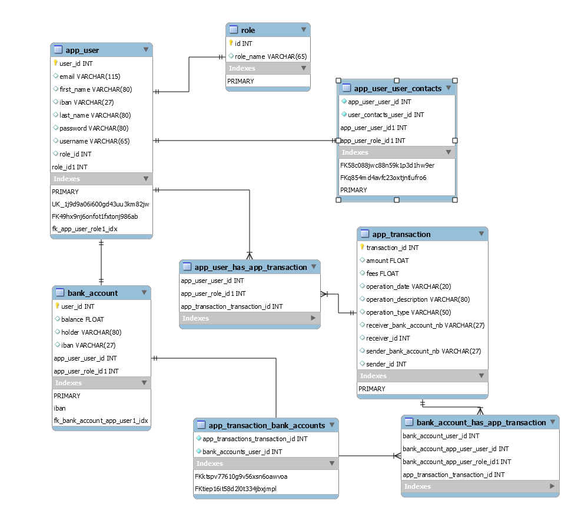
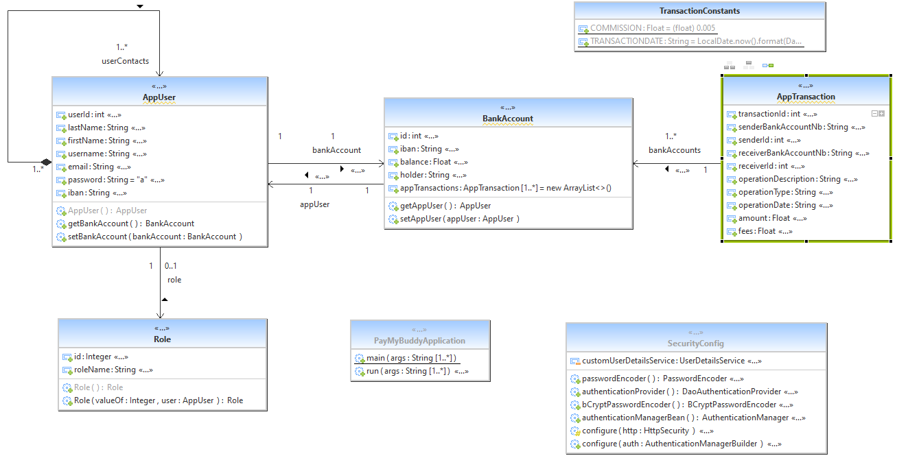

# PayMyBuddy Application

Pay My Buddy is a web application coded in Java for purpose to facilitate money transactions between distant persons.
This is a demo version, not yet implemented.

# Getting Started

These instructions will get you a copy of the project up and running on your local machine for development and testing purposes. See deployment for notes on how to deploy the project on a live system.

### Prerequisites

What things you need to install the software and how to install them

- Java 1.8
- Maven 3.6.2
- Spring Boot (Spring tool suite 4)
- MySql database

### Installing

A step by step series of examples that tell you how to get a development env running:

1.Install Java: [Java](https://docs.oracle.com/javase/8/docs/technotes/guides/install/install_overview.html)

2.Install Maven: [maven](https://maven.apache.org/install.html)

3.Install Spring boot: [Spring Boots](https://spring.io/tools)

4.Install MySql:[MySQL](https://dev.mysql.com/downloads/mysql)

### Running App

In main ressource, you will find details about the script sql and the application properties.
you can excecute following instructions in order to charge data in the database

CREATE DATABASE paymybuddy;
USE paymybuddy;

INSERT INTO app_user (first_name, last_name, email, password, iban, username, role_id, user_id) VALUES ('Admin', 'Admin','admin@gmail.com', '$2a$10$bpNMKeaQXKpJ4JVxOHWvu.tZdmCLT9nKcZreJ/ELfCgmTCyhC7GPy','FR761234123412341234999999', 'admin', 1, 1);
INSERT INTO app_user (first_name, last_name, email, password, iban, username, role_id, user_id) VALUES ('User', 'User','user@gmail.com','$2a$10$TA.UfUqLa8uDeGkt95FfLeq7T5Y5vpDpzAtvJrHSLzLliY/PARXUq','FR761234123412341234888888', 'user', 2, 2);
INSERT INTO app_user(last_name, first_name, email, password, iban, username, role_id, user_id) values('Garnier', 'Fabrice', 'fgarnier@hotmail.com', '$2a$10$TA.UfUqLa8uDeGkt95FfLeq7T5Y5vpDpzAtvJrHSLzLliY/PARXUq','FR7612341234123412341234123','fgarnier@hotmail.com', 2, 3);
INSERT INTO app_user(last_name, first_name, email, password, iban, username, role_id, user_id) values('Martin', 'Pierre', 'pmartin@gmail.com', '$2a$10$TA.UfUqLa8uDeGkt95FfLeq7T5Y5vpDpzAtvJrHSLzLliY/PARXUq','FR8112341234123412341234124','pmartin@gmail.com', 2, 4);
INSERT INTO bank_account(iban, balance, holder, user_id) values('FR761234123412341234999999', 0,'ADMIN',1);
INSERT INTO bank_account(iban, balance, holder, user_id) values('FR761234123412341234888888', 0,'USER',2);
INSERT INTO bank_account(iban, balance, holder, user_id) values('FR7612341234123412341234123', 0,'MR GARNIER FABRICE',3);
INSERT INTO bank_account(iban, balance, holder, user_id) values('FR8112341234123412341234124', 0,'MR MARTIN PIERRE',4);
INSERT INTO app_transaction(sender_bank_account_nb, sender_id, receiver_bank_account_nb, receiver_id, operation_description, amount, operation_date, operation_type, fees) values('FR7612341234123412341234123','3', 'FR7612341234123412341234123','3', 'fund', 500, '19-05-2021', 'fund', 0);
INSERT INTO role (id, role_name) VALUES (1, 'ROLE_ADMIN');
INSERT INTO role (id, role_name) VALUES (2, 'ROLE_USER');

Run the PayMyBuddyApplication.java to launch the application.

### Physical data model paymybuddy :

### UML diagram paymybuddy :

